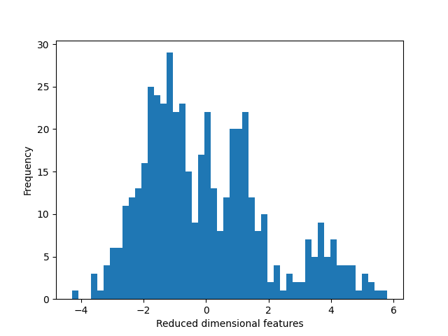

# CellPose分割以及生物模型分析思路

# 1. 分割 segmentation
## 1.1 传统的阈值分割与 CellPose 相比
+ 由于传统的阈值分割存在一些问题，尤其是高重复性实验过程中，参数需要不断的变化，以适应实验条件。
+ 利用cellpose模型可以极大的解决该问题。
## 1.2 将三通道作为分割对象
+ 需要思考一个问题，这里的细胞 FRET靶标对 需要被转染到细胞上才能够作为分析的一种指标
+ 分割思路，采用DD、DA、AA三通道图像作为输入，进行分割操作
## 1.3 CellProfiler进行特征提取操作
+ 利用AA、DA、DD通道提取FI荧光通道信息
+ 利用ED通道提取ED FRET效率图像信息
+ 利用BF_1、BF_2、BF_3提取明场BF图像信息

# 2. 降维分析
## 2.1 PCA 将明场信息降维为 1 维查看信息状态 
### 2.1.1 PCA 降维明场所提取的特征结果
实验数据：使用的是 A1331852 加药组 和 control对照组
我们利用直方图进行降维后特征的统计，划分为50bin大小。

我们可以发现这里隐约可以看到具有3个波峰，对应正常、待定以及凋亡细胞的明场单细胞情况。
我们进一步进行拆分不同labels具体分析。

### 2.1.2 PCA 降维ED所提取的特征结果
